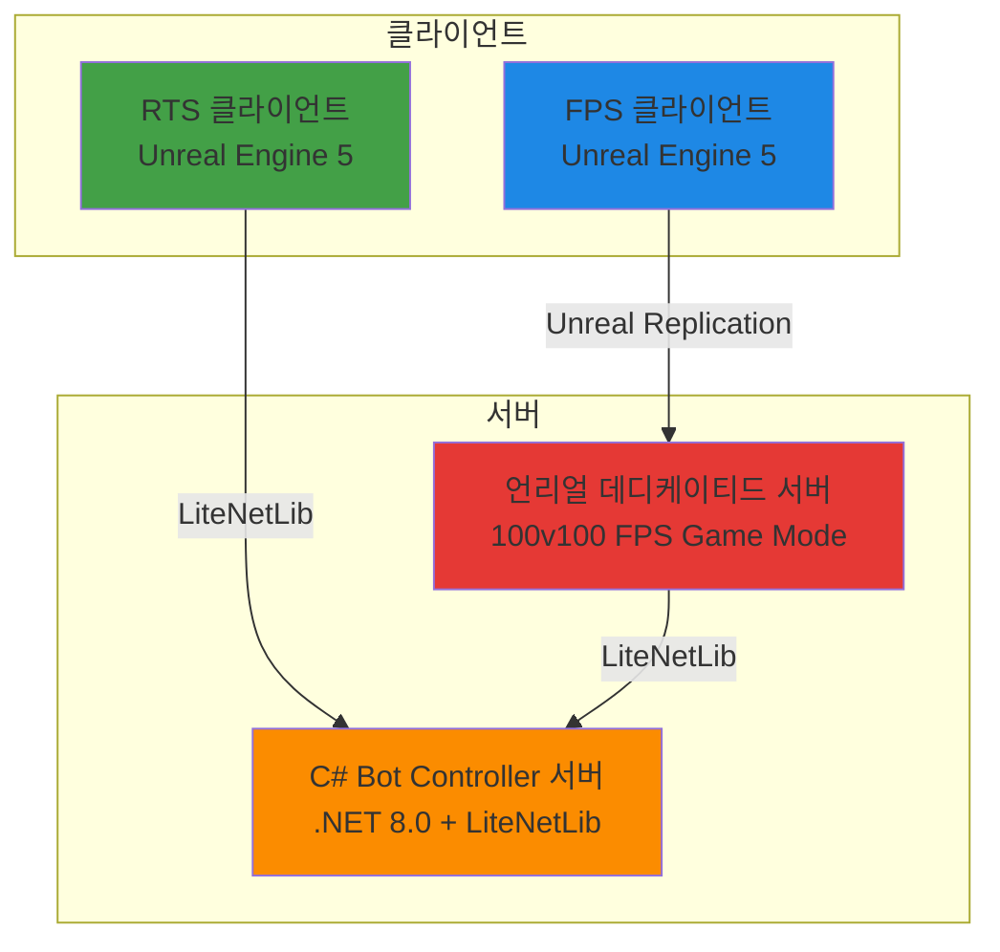
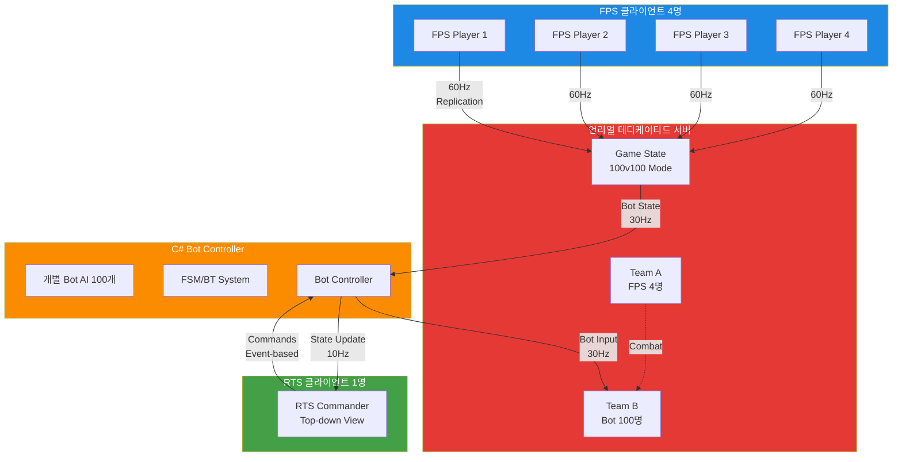
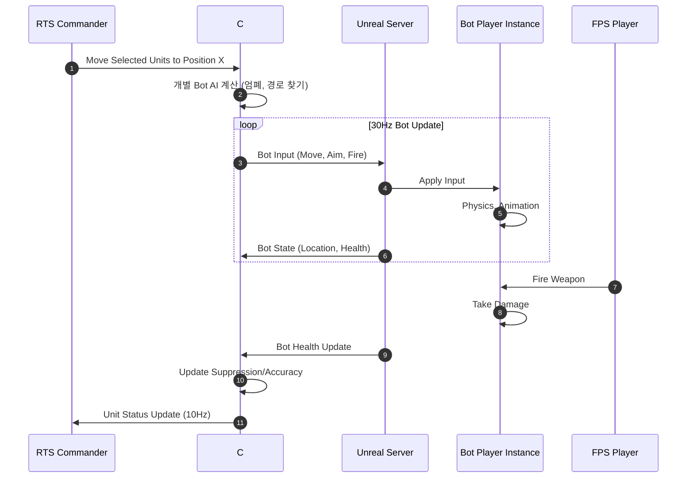
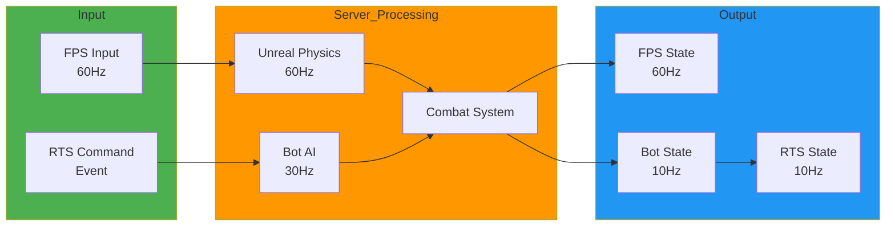
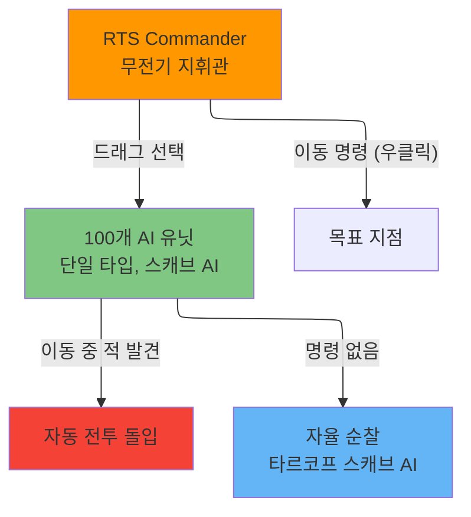
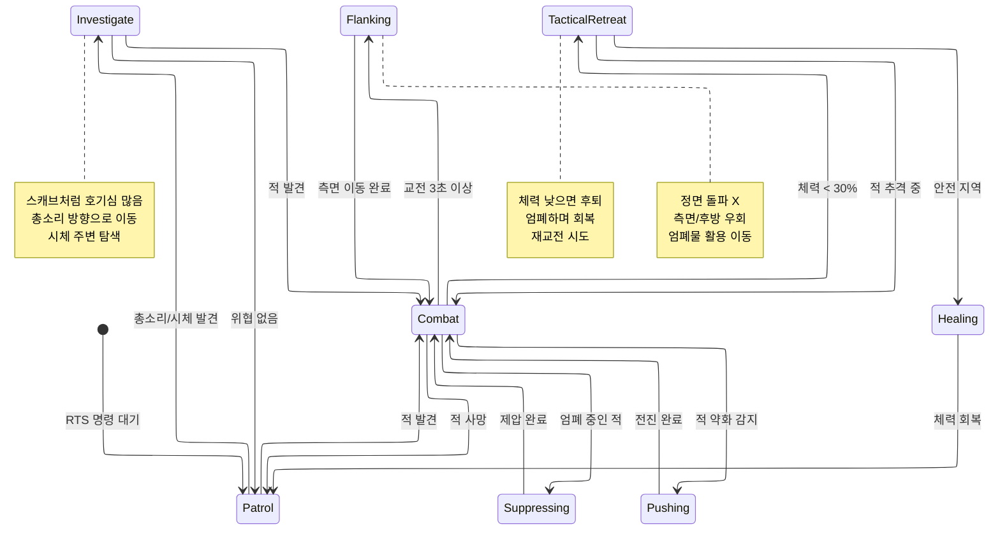
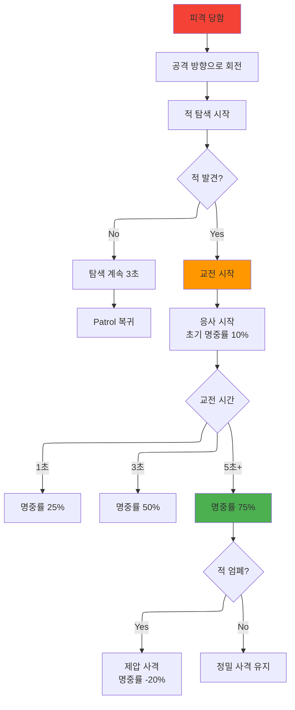
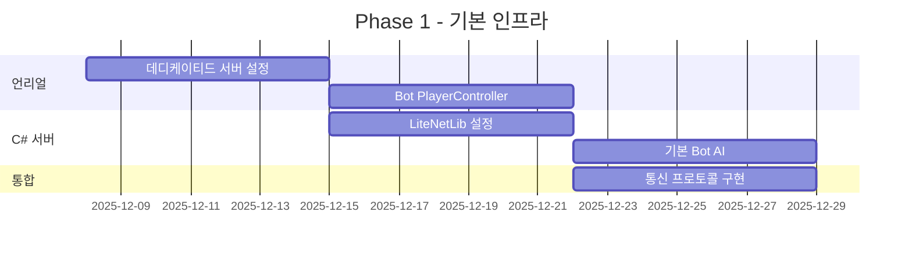
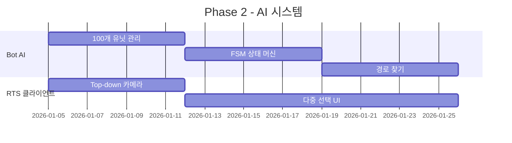
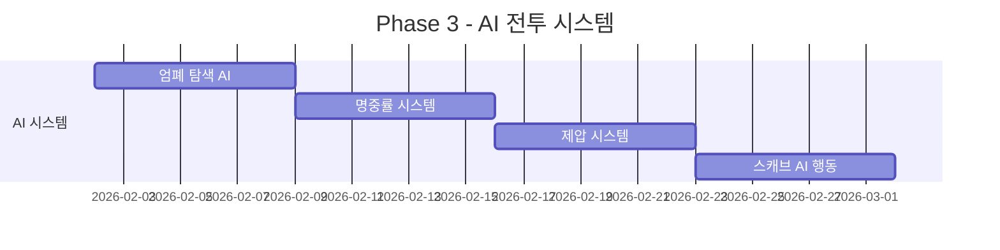

# FPS/RTS 하이브리드 게임 기획서

> **프로젝트명**: TBD
> **장르**: 비대칭 멀티플레이어 (FPS + RTS 하이브리드)
> **타겟 플랫폼**: PC
> **개발 기간**: 12주 (MVP)
> **최종 업데이트**: 2025-12-07

---

## 📋 목차

1. [프로젝트 개요](#프로젝트-개요)
2. [게임 컨셉](#게임-컨셉)
3. [기술 스택](#기술-스택)
4. [네트워크 아키텍처](#네트워크-아키텍처)
5. [게임플레이 시스템](#게임플레이-시스템)
6. [개발 로드맵](#개발-로드맵)
7. [레퍼런스](#레퍼런스)

---

## 프로젝트 개요

### 게임 컨셉
**4인 FPS 스쿼드 vs 1인 RTS 커맨더 (100개 AI 유닛)**

- **FPS 측 (4명)**: 1인칭/3인칭 전투, 전술적 팀플레이
- **RTS 측 (1명)**: 탑다운 뷰, 100개 AI 유닛 지휘 (Company of Heroes 스타일)
- **핵심 경험**: 소수 정예 vs 물량, 비대칭 전략 전투

### 승리 조건

**FPS 스쿼드 승리** (3가지 중 1개):
1. 모든 AI 유닛 섬멸
2. 특수 미션 달성
3. 제한 시간(20분) 생존

**RTS 커맨더 승리**:
- 4인 스쿼드 전원 제거

---

## 기술 스택

### ✅ 최종 결정 사항



#### 클라이언트
- **게임 엔진**: Unreal Engine 5
- **언어**: C++ (게임플레이), Blueprint (UI)
- **네트워크**: Unreal Replication Graph

#### 서버
- **게임 서버**: Unreal Dedicated Server (C++)
- **Bot Controller**: C# .NET 8.0
- **네트워크 라이브러리**: LiteNetLib
- **AI**: C# FSM + Behavior Tree

### 기술 스택 선택 이유

| 요구사항 | 해결 방법 |
|---------|---------|
| 회사 요구: 언리얼 + C# 백엔드 | ✅ 언리얼 클라이언트 + C# Bot 서버 |
| FPS 레이턴시 (<50ms) | ✅ Unreal Replication Graph |
| 100개 유닛 관리 | ✅ C# Bot Controller (효율적) |
| 빠른 개발 | ✅ LiteNetLib (6개월 → 2주) |

---

## 네트워크 아키텍처

### 전체 아키텍처



### AI Bot 인스턴스 구조

**핵심 아이디어**: AI는 "진짜 플레이어"처럼 동작



### 데이터 플로우



### 네트워크 데이터량

| 클라이언트 | 전송 주기 | 데이터량 | 대역폭 |
|-----------|---------|---------|--------|
| FPS → Unreal | 60Hz | 20 bytes/tick | 4.8 KB/s |
| RTS → C# Bot | Event | 50 bytes/cmd | 0.15 KB/s |
| Unreal → C# Bot | 30Hz | 17 bytes/bot | 51 KB/s (100 bots) |
| C# Bot → Unreal | 30Hz | 15 bytes/bot | 45 KB/s (100 bots) |
| C# Bot → RTS | 10Hz | 17 bytes/unit | 17 KB/s (100 units, Interest Mgmt) |

**총 대역폭**: ~105 KB/s (매우 낮음)

---

## 게임플레이 시스템

### RTS 컨트롤 시스템 (무전기 지휘관 컨셉)

#### 유닛 구성 (총 100개 동일 유닛)



**핵심 컨셉**:
- **단일 유닛 타입**: 모든 유닛이 동일 (개발 시간 절약)
- **무전기 지휘**: RTS는 "어디로 가라" 정도만 명령 가능
- **자율 AI**: 명령 없으면 타르코프 스캐브처럼 자율 행동
- **이동 중 교전**: 목표 지점으로 이동 중 적 발견 시 자동으로 전투

#### RTS 명령 체계

**가능한 명령 (최소한)**:
1. **이동 명령**: 우클릭으로 목표 지점 지정
2. **선택**: 드래그로 다중 선택

**불가능한 것**:
- 컨트롤 그룹 (Ctrl+1~9) ❌
- 스탠스 변경 (공격적/수비적) ❌
- 엄폐 위치 지정 ❌
- 공격 대상 지정 ❌

**AI가 자동 처리**:
- 엄폐물 찾기 및 사용
- 전투 개시 및 타겟 선택
- 측면 공격, 후퇴, 회복

#### Bot AI 상태 머신 (타르코프 스캐브 스타일)



### 전투 시스템

#### 명중률 시스템 (타르코프 스캐브 스타일)



**핵심 메커니즘**:
- **반응 시간**: 피격 시 0.2~0.5초 후 반응 (인간적인 딜레이)
- **탐색 단계**: 공격 방향 ±30도 범위 스캔
- **명중률 상승**: 같은 적을 지속 관찰할수록 정확도 증가
  - 0~1초: 10% (패닉 상태)
  - 1~3초: 25% (적 파악)
  - 3~5초: 50% (조준 개선)
  - 5초+: 75% (완전 집중)
- **리셋 조건**: 시야 상실 시 명중률 초기화

#### 제압 시스템 (Suppression)

| 제압 단계 | 효과 | 발동 조건 |
|---------|------|---------|
| 없음 | 정상 | - |
| 경미 (30%) | 명중률 -10% | 집중 사격 3초 |
| 중간 (60%) | 명중률 -20%, 이동속도 -30% | 집중 사격 6초 |
| 심각 (90%) | 명중률 -30%, 이동속도 -50%, 강제 엄폐 | 집중 사격 10초 |

---

## 개발 로드맵

### Phase 1: 기본 인프라 (4주)



**목표**: 4 FPS vs 30 Bot 기본 동작

**마일스톤**:
- [x] 언리얼 100v100 GameMode 설정
- [ ] Bot PlayerController 기본 이동
- [ ] C# 서버 LiteNetLib 연결
- [ ] 언리얼 ↔ C# 통신 프로토콜

---

### Phase 2: AI 및 RTS 통합 (4주)



**목표**: RTS 커맨더가 유닛 조작 가능

**마일스톤**:
- [ ] 100개 동일 유닛 생성 및 관리
- [ ] RTS UI (드래그 선택, 이동 명령만)
- [ ] 기본 경로 찾기 (A*)
- [ ] C# → Unreal Bot 입력 전송

---

### Phase 3: AI 전투 시스템 (4주)



**목표**: 타르코프 스캐브 스타일 AI 완성

**마일스톤**:
- [ ] 엄폐물 자동 탐색 AI
- [ ] 명중률 시스템 (피격 반응, 관찰 시간별 정확도 증가)
- [ ] 제압 시스템 (AI만 영향받음)
- [ ] 자율 순찰/조사/측면 공격 AI

---

### Phase 4: 폴리싱 및 최적화 (추가)

**목표**: 밸런스 튜닝, 성능 최적화

- [ ] 3-Tier Interest Management 튜닝
- [ ] 네트워크 대역폭 최적화
- [ ] UI/UX 개선
- [ ] 사운드/이펙트

---

## 레퍼런스

### 핵심 참고작

| 게임 | 참고 요소 | 우선순위 |
|-----|---------|---------|
| **Company of Heroes 2** | 엄폐/제압/사기 시스템, 분대 컨트롤 | ⭐⭐⭐⭐⭐ |
| **Men of War** | 전술적 세밀함, 유닛 AI | ⭐⭐⭐⭐ |
| **Natural Selection 2** | FPS+RTS 하이브리드 구조 | ⭐⭐⭐⭐ |
| **Evolve** | 4v1 비대칭 밸런스 | ⭐⭐⭐ |
| **Squad** | 밀리터리 시뮬레이션, 팀워크 | ⭐⭐⭐ |

### 게임플레이 참고 영상

- [Company of Heroes 2 - Cover System](https://www.youtube.com/watch?v=...)
- [Natural Selection 2 - Commander Mode](https://www.youtube.com/watch?v=...)
- [Men of War - Tactical Gameplay](https://www.youtube.com/watch?v=...)

---

## 기술 문서

### C# Bot Controller 구현 예시

```csharp
// BotControllerServer.cs
using LiteNetLib;
using System.Collections.Generic;

class BotControllerServer : INetEventListener {
    NetManager unrealServer;
    NetManager rtsClient;

    Dictionary<int, BotAgent> bots = new(); // 100개 독립 유닛

    void Start() {
        // 언리얼 서버 연결
        unrealServer = new NetManager(this);
        unrealServer.Start();
        unrealServer.Connect("127.0.0.1", 7777, "");

        // RTS 클라이언트 리스너
        rtsClient = new NetManager(this);
        rtsClient.Start(8888);

        InitializeBots(100); // 100개 독립 유닛 생성
        GameLoop();
    }

    void GameLoop() {
        while (running) {
            unrealServer.PollEvents();
            rtsClient.PollEvents();

            // 개별 Bot AI 업데이트 (30Hz)
            foreach (var bot in bots.Values) {
                bot.UpdateAI(deltaTime);
            }

            // Bot 입력 전송
            SendBotInputsToUnreal();

            Thread.Sleep(33); // 30Hz
        }
    }

    void OnNetworkReceive(NetPeer peer, NetPacketReader reader,
        byte channel, DeliveryMethod method) {

        PacketType type = (PacketType)reader.GetByte();

        switch (type) {
            case PacketType.BotState:
                HandleBotState(reader);
                break;
            case PacketType.RTSCommand:
                HandleRTSCommand(reader);
                break;
        }
    }

    void HandleBotState(NetPacketReader reader) {
        int botID = reader.GetInt();
        var bot = bots[botID];

        // 체력 변화 감지 (피격)
        float newHealth = reader.GetFloat();
        if (newHealth < bot.Health) {
            int attackerID = reader.GetInt();
            bot.OnDamaged(attackerID); // 명중률 시스템 트리거
        }

        bot.UpdateState(reader);
    }
}

// BotAgent.cs - 명중률 시스템
class BotAgent {
    int currentTargetID = -1;
    float targetObservationTime = 0f;

    public void OnDamaged(int attackerID) {
        // 공격자 방향으로 회전
        Vector3 attackerPos = GetBotPosition(attackerID);
        LookAt(attackerPos);

        // 새로운 타겟으로 전환
        if (currentTargetID != attackerID) {
            currentTargetID = attackerID;
            targetObservationTime = 0f; // 명중률 초기화
        }

        // 상태 전환: Patrol → Combat
        TransitionToState(BotState.Combat);
    }

    public void UpdateCombat(float deltaTime) {
        if (currentTargetID == -1) return;

        // 시야 체크
        if (!CanSeeTarget(currentTargetID)) {
            targetObservationTime = 0f; // 명중률 리셋
            currentTargetID = -1;
            return;
        }

        // 관찰 시간 누적
        targetObservationTime += deltaTime;

        // 명중률 계산 (타르코프 스캐브 스타일)
        float accuracy = CalculateAccuracy(targetObservationTime);

        // 사격 (명중률 적용)
        if (Random.value < accuracy) {
            FireWeapon(currentTargetID);
        }
    }

    float CalculateAccuracy(float observationTime) {
        if (observationTime < 1f) return 0.10f;      // 패닉 상태
        if (observationTime < 3f) return 0.25f;      // 적 파악
        if (observationTime < 5f) return 0.50f;      // 조준 개선
        return 0.75f;                                 // 완전 집중
    }
}
```

### 언리얼 Bot PlayerController

```cpp
// ABotPlayerController.h
UCLASS()
class ABotPlayerController : public APlayerController {
    GENERATED_BODY()

public:
    // C# 서버로부터 입력 수신
    void ReceiveBotInput(FVector MoveDir, FRotator AimRot, bool bFire);

    virtual void Tick(float DeltaTime) override;

private:
    TSharedPtr<FSocket> BotControllerSocket;

    void SendStateToController();
};

// ABotPlayerController.cpp
void ABotPlayerController::Tick(float DeltaTime) {
    Super::Tick(DeltaTime);

    // C# 서버에 상태 전송
    if (GetWorld()->TimeSeconds - LastSendTime > 0.033f) {
        SendStateToController();
        LastSendTime = GetWorld()->TimeSeconds;
    }
}

void ABotPlayerController::SendStateToController() {
    FBotStatePacket Packet;
    Packet.BotID = GetUniqueID();
    Packet.Location = GetPawn()->GetActorLocation();
    Packet.Health = GetPawn()->GetHealth();
    Packet.Suppression = SuppressionLevel;

    // LiteNetLib 전송
    SendPacketToController(Packet);
}
```

---

## 부록

### 프로토콜 정의

```csharp
// Network Packet Types
enum PacketType : byte {
    // Unreal → C#
    BotState = 1,
    BotDeath = 2,
    BotDamaged = 3,

    // C# → Unreal
    BotInput = 10,

    // RTS → C#
    MoveUnits = 20,      // 선택된 유닛들 이동 (유일한 명령)

    // C# → RTS
    UnitState = 30,      // 개별 유닛 상태
    BattleEvent = 31     // 전투 이벤트
}

// Bot State (Unreal → C#)
struct BotStatePacket {
    byte PacketType;    // 1 byte
    int BotID;          // 4 bytes
    Vector3 Location;   // 12 bytes
    float Health;       // 4 bytes
    float Suppression;  // 4 bytes
    int LastAttackerID; // 4 bytes (피격 방향 계산용)
    // Total: 29 bytes
}

// Bot Input (C# → Unreal)
struct BotInputPacket {
    byte PacketType;     // 1 byte
    int BotID;           // 4 bytes
    Vector3 MoveDir;     // 12 bytes
    Quaternion AimRot;   // 16 bytes
    byte Flags;          // 1 byte (Fire, Reload, etc.)
    // Total: 34 bytes
}
```

### 성능 목표

| 지표 | 목표 | 측정 방법 |
|-----|------|---------|
| 서버 FPS | 60 FPS | Unreal Profiler |
| 클라이언트 FPS | 60+ FPS | In-game Counter |
| 네트워크 레이턴시 | <50ms (국내) | Ping Display |
| Bot AI 업데이트 | 30Hz | C# Profiler |
| RTS UI 응답성 | <100ms | Input → Visual |
| 메모리 사용량 | <4GB (서버) | Task Manager |

---

## 문서 히스토리

| 날짜 | 버전 | 변경사항 | 작성자 |
|-----|------|---------|--------|
| 2025-12-07 | 1.0 | 초안 작성, 기술 스택 확정 | - |
| 2025-12-07 | 1.1 | 사기 시스템 제거, 타르코프 스캐브 AI 적용, 명중률 시스템 추가 | - |
| 2025-12-07 | 1.2 | 분대 시스템 제거, 100개 독립 유닛으로 변경 | - |
| 2025-12-07 | 1.3 | 특수 능력 시스템 전체 제거 | - |
| 2025-12-07 | 1.4 | RTS 최소화 - 무전기 지휘관 컨셉, 이동 명령만, 단일 유닛 타입 | - |

---

## 추가 자료

- [언리얼 엔진 5 문서](https://docs.unrealengine.com/)
- [LiteNetLib GitHub](https://github.com/RevenantX/LiteNetLib)
- [Company of Heroes 2 Wiki](https://companyofheroes.fandom.com/)
