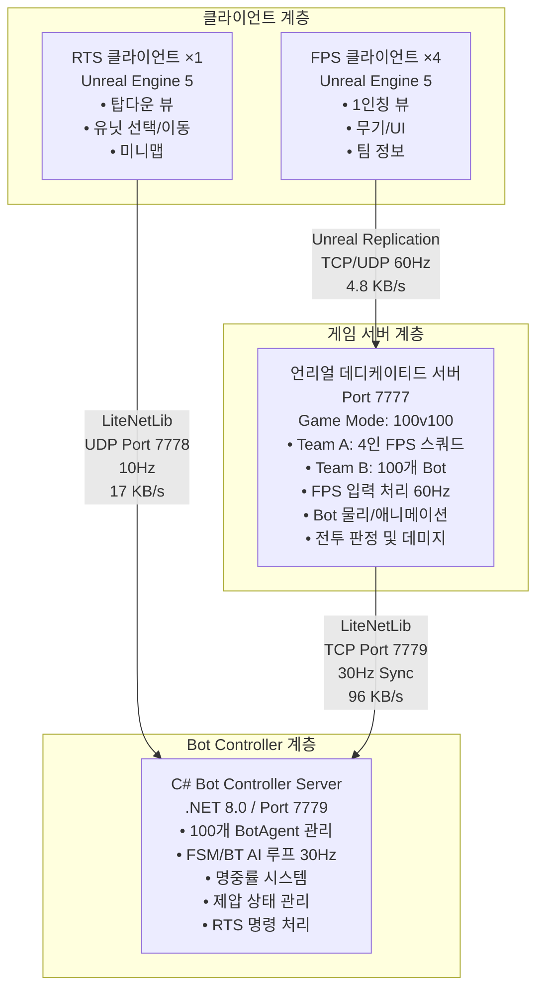
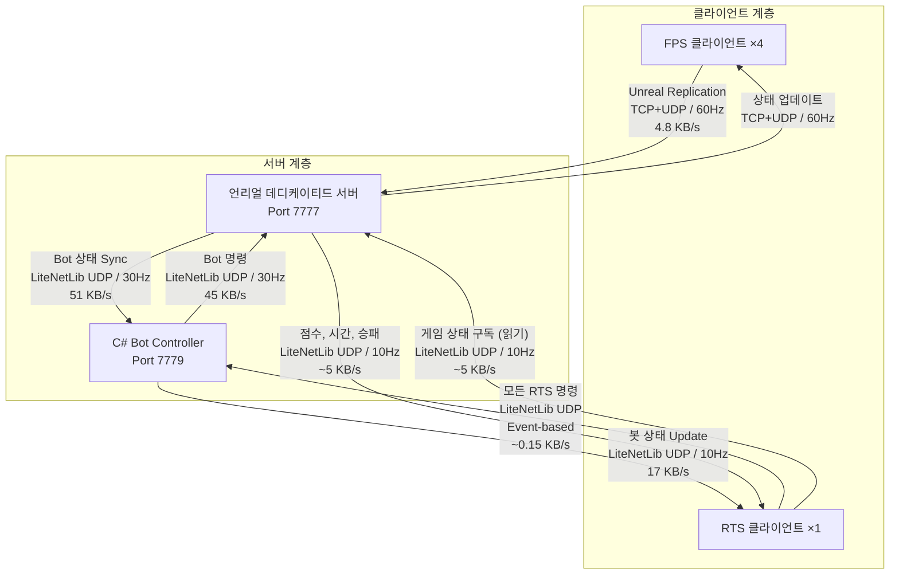

# FPS/RTS 하이브리드 네트워크 아키텍처

## 1. 전체 시스템 아키텍처

### 1.1 아키텍처 다이어그램



### 1.2 통신 프로토콜



**총 대역폭 계산**
```
FPS ↔ Unreal:        4.8 KB/s
Unreal ↔ C# Bot:    96 KB/s
RTS → C# Bot:       ~0.15 KB/s (명령)
C# Bot → RTS:       17 KB/s (봇 상태)
RTS ↔ Unreal:       ~5 KB/s (게임 상태, 읽기 전용)
───────────────────────────────
총 대역폭:          ~123 KB/s (0.984 Mbps)

효율성 비교:
• Twitch 스트리밍: 8 Mbps
• 본 게임: ~1 Mbps (약 123 KB/s)
• 효율성: 스트리밍의 1.2% 수준
```

### 1.2.1 통신 채널 상세

**채널 1: FPS ↔ 언리얼 (60Hz) - 플레이어 입출력**
```
구성요소: FPS 플레이어 입력 & 게임 상태
크기: 20B/tick = 4.8 KB/s
내용:
  - 플레이어 위치: 12B (X, Y, Z)
  - 플레이어 회전: 12B (Yaw, Pitch, Roll)
  - 입력 플래그: 1B (이동, 점프, 사격, 재장전)
```

**채널 2: 언리얼 ↔ C# Bot Controller (30Hz) - 봇 상태 동기화**
```
구성요소: Bot 상태 양방향 동기화
크기: 96 KB/s (총)
  - Unreal → C#: 51 KB/s (17B × 100 봇 × 30Hz)
    → 봇 상태: ID, 위치(12B), 체력(1B), 제압도(1B), 상태 플래그(1B)
  
  - C# → Unreal: 45 KB/s (15B × 100 봇 × 30Hz)
    → 봇 입력: ID, 이동 방향, 조준 각도, 행동, FSM 상태

목적: C#에서 결정한 봇 명령을 Unreal에서 물리/애니메이션으로 실행
```

**채널 3: RTS → C# Bot Controller (Event) - RTS 명령 전송**
```
구성요소: RTS 명령 (모든 컨트롤 명령의 진입점)
크기: ~0.15 KB/s (이벤트 기반)
내용:
  - 명령 타입: 이동, 제압사격, 후퇴, 집결 등
  - 대상 유닛 ID: 선택된 봇 ID 리스트
  - 목표 위치: 또는 목표 객체

목적: RTS 명령을 C#이 검증하고 봇 FSM에 반영
C#이 명령의 유일한 진입점 → 일관성 보장
```

**채널 4: C# → RTS (10Hz) - 봇 상태 브로드캐스트**
```
구성요소: RTS UI용 봇 상태 피드백
크기: 17 KB/s (17B × 100 봇 × 10Hz)
내용:
  - 봇 ID, 위치, 체력%, 상태(순찰/전투/후퇴/부상)
  - 그룹 정보, 제압도, 탄약 상태

목적: RTS 미니맵, 유닛 정보 창 UI 업데이트
```

**채널 5: RTS ↔ 언리얼 (10Hz) - 게임 상태 (읽기 전용)**
```
구성요소: 게임 메타 정보 (점수, 시간, 팀 정보)
크기: ~5 KB/s
내용:
  - 남은 시간: 4B
  - FPS 팀 점수: 2B
  - Bot 팀 남은 수: 2B
  - 게임 상태: 준비/진행/종료 (1B)
  - 패배 원인, 승자 팀: 2B

목적: RTS가 게임 진행 상황을 모니터링 (읽기만 수행)
```

### 1.2.2 명령 흐름 설계 원칙

| 구분 | FPS | RTS |
|------|-----|-----|
| **플레이어 입력** | 언리얼 직접 처리 | C# Bot Controller 거쳐서 처리 |
| **게임 상태 읽기** | Unreal Replication | Unreal 직접 구독 |
| **명령 유효성 검증** | 언리얼 (물리/애니메이션) | C# (FSM/AI 로직) |
| **성능 최적화** | 60Hz 고주파 동기화 | 10-30Hz 저주파 동기화 |

**이점:**
- C# Bot Controller가 모든 RTS 명령의 진입점 → 봇 AI 일관성 보장
- RTS는 언리얼 게임 상태만 읽음 → 느슨한 결합
- 명령-실행-피드백 루프가 명확함

---

## 2. 언리얼 데디케이티드 서버

### 2.1 GameMode 설정

```cpp
// AHybridGameMode.h
UCLASS()
class HYBRIDGAME_API AHybridGameMode : public AGameMode {
    GENERATED_BODY()

public:
    virtual void BeginPlay() override;
    virtual void Tick(float DeltaTime) override;

    // 플레이어 배정
    virtual void PostLogin(APlayerController* NewPlayer) override;

    // 게임 상태 관리
    void StartGame();
    void EndGame();

private:
    // 팀 정보
    class ATeamInfo* RedTeam;    // FPS 스쿼드 (4명)
    class ATeamInfo* BlueTeam;   // Bot 팀 (100개)

    // Bot 스폰
    void SpawnBots(int32 BotCount);

    // C# Bot 컨트롤러 연동
    class UBotControllerClient* BotController;
    void InitBotControllerConnection();

    // 게임 루프
    void UpdateGameLogic(float DeltaTime);
    void SyncBotStates(float DeltaTime);
    void CheckWinConditions();
};

// AHybridGameMode.cpp
void AHybridGameMode::BeginPlay() {
    Super::BeginPlay();

    // C# Bot Controller 연결
    InitBotControllerConnection();

    // 100개 Bot 스폰
    SpawnBots(100);

    // 게임 시작 대기 (2분)
    GetWorldTimerManager().SetTimer(
        GameStartTimerHandle,
        this,
        &AHybridGameMode::StartGame,
        120.0f,
        false
    );
}

void AHybridGameMode::Tick(float DeltaTime) {
    Super::Tick(DeltaTime);

    if (bGameInProgress) {
        UpdateGameLogic(DeltaTime);
        SyncBotStates(DeltaTime); // 30Hz
        CheckWinConditions();
    }
}
```

### 2.2 Bot PlayerController

```cpp
// ABotPlayerController.h
UCLASS()
class HYBRIDGAME_API ABotPlayerController : public APlayerController {
    GENERATED_BODY()

public:
    virtual void BeginPlay() override;
    virtual void Tick(float DeltaTime) override;

    // C# Bot Controller로부터 입력 수신
    void ReceiveBotInput(const FBotInputPacket& InputPacket);

    // 상태 전송
    void SendBotStateToController();

    // Bot 참조
    UPROPERTY()
    class ACharacter* ControlledBot;

private:
    // 네트워크
    class UBotControllerClient* BotControllerClient;

    // 마지막 상태 전송 시간
    float LastStateSendTime = 0.0f;
    const float STATE_SEND_INTERVAL = 0.033f; // 30Hz
};

// ABotPlayerController.cpp
void ABotPlayerController::Tick(float DeltaTime) {
    Super::Tick(DeltaTime);

    // 30Hz로 상태 전송
    LastStateSendTime += DeltaTime;
    if (LastStateSendTime >= STATE_SEND_INTERVAL) {
        SendBotStateToController();
        LastStateSendTime = 0.0f;
    }
}

void ABotPlayerController::ReceiveBotInput(const FBotInputPacket& InputPacket) {
    if (!ControlledBot) return;

    // 입력을 Pawn에 적용
    if (ACharacter* BotChar = Cast<ACharacter>(ControlledBot)) {
        // 이동
        BotChar->AddMovementInput(
            InputPacket.MoveDirection.GetUnsafeNormal(),
            1.0f
        );

        // 회전
        BotChar->SetActorRotation(InputPacket.AimRotation);

        // 사격
        if (InputPacket.bShouldFire) {
            // 무기 발사 로직
        }
    }
}

void ABotPlayerController::SendBotStateToController() {
    if (!ControlledBot || !BotControllerClient) return;

    FBotStatePacket StatePacket;
    StatePacket.BotID = ControlledBot->GetUniqueID();
    StatePacket.Location = ControlledBot->GetActorLocation();
    StatePacket.Health = GetCharacterHealth();
    StatePacket.Suppression = GetSuppressionLevel();
    StatePacket.LastAttackerID = LastAttackerID;

    BotControllerClient->SendPacket(StatePacket);
}
```

### 2.3 게임 상태 관리

```cpp
// AGameStateBase 확장
UCLASS()
class HYBRIDGAME_API AHybridGameState : public AGameState {
    GENERATED_BODY()

public:
    // 팀별 점수
    UPROPERTY(Replicated)
    int32 RedTeamScore = 0;

    UPROPERTY(Replicated)
    int32 BlueTeamScore = 0;

    // 게임 진행 시간
    UPROPERTY(Replicated)
    int32 GameTimeSeconds = 0;

    // Bot 생존 수
    UPROPERTY(Replicated)
    int32 AliveBotCount = 100;

    // 승리 조건 확인
    bool CheckFPSSquadVictory() const;
    bool CheckBotCommander Victory() const;
};
```

---

## 3. C# Bot Controller 서버

### 3.1 서버 구조

```csharp
// Program.cs
using LiteNetLib;
using System.Collections.Generic;

class BotControllerServer {
    private NetManager unrealConnection;
    private NetManager rtsConnection;
    private Dictionary<int, BotAgent> bots;

    static void Main(string[] args) {
        var server = new BotControllerServer();
        server.Start();
        server.Run();
    }

    void Start() {
        // Unreal 서버와 연결 (Port 7779)
        unrealConnection = new NetManager(new UnrealEventListener(this));
        unrealConnection.Start(7779);

        // RTS 클라이언트 수신 (Port 7778)
        rtsConnection = new NetManager(new RTSEventListener(this));
        rtsConnection.Start(7778);

        // 100개 Bot 초기화
        for (int i = 0; i < 100; i++) {
            bots[i] = new BotAgent(i, this);
        }
    }

    void Run() {
        while (running) {
            unrealConnection.PollEvents();
            rtsConnection.PollEvents();

            // 개별 Bot AI 루프 (30Hz)
            foreach (var bot in bots.Values) {
                bot.UpdateAI(deltaTime);
            }

            // Bot 입력 전송 (30Hz)
            SendBotInputsToUnreal();

            // RTS 상태 전송 (10Hz)
            SendRTSUpdate();

            Thread.Sleep(33); // 30Hz = 33ms
        }
    }
}
```

### 3.2 Bot Agent 클래스

```csharp
// BotAgent.cs
public class BotAgent {
    public int BotID { get; }
    public Vector3 Position { get; set; }
    public float Health { get; set; }
    public BotState CurrentState { get; set; }
    public float Suppression { get; set; }
    public int CurrentTargetID { get; set; } = -1;
    public float TargetObservationTime { get; set; }

    private BotControllerServer server;
    private FSMController fsm;
    private TargetingSystem targeting;

    public BotAgent(int botID, BotControllerServer server) {
        BotID = botID;
        this.server = server;
        Health = 100;
        CurrentState = BotState.Patrol;
        fsm = new FSMController(this);
        targeting = new TargetingSystem(this);
    }

    public void UpdateAI(float deltaTime) {
        // 상태 머신 업데이트
        fsm.Update(deltaTime);

        // 전투 로직
        if (CurrentState == BotState.Combat) {
            UpdateCombat(deltaTime);
        }

        // 제압 감소
        UpdateSuppression(deltaTime);
    }

    void UpdateCombat(float deltaTime) {
        // 목표 선택
        if (CurrentTargetID == -1) {
            CurrentTargetID = targeting.FindTarget();
        }

        if (CurrentTargetID == -1) return;

        // 관찰 시간 누적
        TargetObservationTime += deltaTime;

        // 명중률 계산
        float accuracy = CalculateAccuracy(TargetObservationTime);

        // 사격
        if (Random.value < accuracy) {
            FireWeapon(CurrentTargetID);
        }
    }

    float CalculateAccuracy(float observationTime) {
        if (observationTime < 1f) return 0.10f;  // 10%
        if (observationTime < 3f) return 0.25f;  // 25%
        if (observationTime < 5f) return 0.50f;  // 50%
        return 0.75f;                             // 75%
    }

    void UpdateSuppression(float deltaTime) {
        // 제압 자동 감소
        float suppressionReduction = 5.0f * deltaTime; // 초당 5%

        if (CurrentState == BotState.Combat) {
            // 엄폐 중: 더 빠르게 감소
            suppressionReduction *= 2.0f;
        }

        Suppression = Math.Max(0, Suppression - suppressionReduction);
    }

    public void OnDamaged(int attackerID, float damageAmount) {
        Health -= damageAmount;

        // 피격 반응
        CurrentTargetID = attackerID;
        TargetObservationTime = 0; // 명중률 초기화

        // 제압 증가
        Suppression = Math.Min(100, Suppression + 20);

        // 상태 전환
        fsm.TransitionTo(BotState.Combat);
    }
}

public enum BotState {
    Patrol,
    Investigate,
    Combat,
    TacticalRetreat,
    Healing
}
```

### 3.3 네트워크 이벤트 리스너

```csharp
// UnrealEventListener.cs
public class UnrealEventListener : INetEventListener {
    private BotControllerServer server;

    public void OnPeerConnected(NetPeer peer) {
        Console.WriteLine("Unreal 서버 연결됨");
    }

    public void OnNetworkReceive(NetPeer peer, NetPacketReader reader, byte channelNumber, DeliveryMethod deliveryMethod) {
        byte packetType = reader.GetByte();

        switch (packetType) {
            case (byte)PacketType.BotState:
                HandleBotState(peer, reader);
                break;
            case (byte)PacketType.BotDamaged:
                HandleBotDamaged(peer, reader);
                break;
            case (byte)PacketType.BotDeath:
                HandleBotDeath(peer, reader);
                break;
        }
    }

    void HandleBotState(NetPeer peer, NetPacketReader reader) {
        int botID = reader.GetInt();
        Vector3 location = reader.GetVector3();
        float health = reader.GetFloat();
        float suppression = reader.GetFloat();
        int lastAttackerID = reader.GetInt();

        var bot = server.GetBot(botID);
        if (bot != null) {
            bot.Position = location;
            bot.Health = health;
            bot.Suppression = suppression;

            // 피격 감지
            if (lastAttackerID >= 0) {
                bot.OnDamaged(lastAttackerID, 10); // 기본 데미지
            }
        }
    }
}

// RTSEventListener.cs
public class RTSEventListener : INetEventListener {
    private BotControllerServer server;

    void HandleRTSCommand(NetPeer peer, NetPacketReader reader) {
        byte commandType = reader.GetByte();

        switch ((RTSCommandType)commandType) {
            case RTSCommandType.MoveUnits:
                HandleMoveUnits(reader);
                break;
            case RTSCommandType.AttackUnits:
                HandleAttackUnits(reader);
                break;
        }
    }

    void HandleMoveUnits(NetPacketReader reader) {
        // 선택된 유닛 ID 읽기
        int selectedCount = reader.GetInt();
        var selectedBotIDs = new List<int>(selectedCount);

        for (int i = 0; i < selectedCount; i++) {
            selectedBotIDs.Add(reader.GetInt());
        }

        // 목표 위치
        Vector3 targetPosition = reader.GetVector3();

        // 각 Bot에 이동 명령 발행
        foreach (int botID in selectedBotIDs) {
            var bot = server.GetBot(botID);
            if (bot != null) {
                bot.CurrentState = BotState.Moving;
                bot.TargetPosition = targetPosition;
            }
        }
    }
}
```

---

## 4. 클라이언트 구현

### 4.1 FPS 클라이언트 (Unreal)

```cpp
// AFPSPlayerController.h
UCLASS()
class HYBRIDGAME_API AFPSPlayerController : public APlayerController {
    GENERATED_BODY()

public:
    virtual void SetupInput(class UInputComponent* PlayerInputComponent) override;
    virtual void Tick(float DeltaTime) override;

private:
    // 입력 처리
    void MoveForward(float Value);
    void MoveRight(float Value);
    void LookUp(float Value);
    void Turn(float Value);
    void Fire();

    // Replication Graph
    void SetupReplicationGraph();
};
```

### 4.2 RTS 클라이언트 (Unreal)

```cpp
// ARTSController.h
UCLASS()
class HYBRIDGAME_API ARTSController : public APlayerController {
    GENERATED_BODY()

public:
    virtual void SetupInput(class UInputComponent* PlayerInputComponent) override;
    virtual void Tick(float DeltaTime) override;

    // 선택 시스템
    void SelectUnit(const FHitResult& HitResult);
    void SelectMultipleUnits(const FBox& SelectionBox);
    void ClearSelection();

    // 명령
    void IssueMovCommand(const FVector& TargetLocation);
    void IssueAttackCommand(const FVector& TargetLocation);
    void IssueStopCommand();

    // 네트워크
    void SendCommandToBotController(const FRTSCommand& Command);

private:
    // 선택된 유닛 ID 목록
    TSet<int32> SelectedUnitIDs;

    // LiteNetLib 클라이언트
    class ULiteNetLibClient* NetClient;

    // UI
    class URTSHud* HUD;
};
```

---

## 5. 동기화 메커니즘

### 5.1 FPS 플레이어 동기화 (60Hz)

```
클라이언트 → 서버:
┌─────────────────┐
│ Player Position │ 12 bytes
│ Player Rotation │ 12 bytes
│ Input Flags     │ 1 byte
└─────────────────┘
→ Unreal Replication Graph

서버 → 클라이언트:
┌──────────────────────┐
│ Enemy Position       │ 12 bytes × N
│ Enemy Rotation       │ 12 bytes × N
│ Enemy Health         │ 1 byte × N
│ Bot State            │ 1 byte × N
└──────────────────────┘
```

### 5.2 Bot 동기화 (30Hz)

```
Unreal → C# Bot:
┌──────────────────────┐
│ Bot ID               │ 4 bytes
│ Position             │ 12 bytes
│ Health               │ 1 byte
│ Suppression          │ 1 byte
│ Last Attacker ID     │ 4 bytes
│ State Flags          │ 1 byte
│ ────────────────────│
│ Total: 17 bytes      │
│ × 100 bots = 1700B   │
│ @ 30Hz = 51 KB/s     │
└──────────────────────┘

C# Bot → Unreal:
┌──────────────────────┐
│ Bot ID               │ 4 bytes
│ Move Direction       │ 12 bytes
│ Aim Rotation         │ 4 bytes (compressed)
│ Fire Flag            │ 1 byte
│ Reload Flag          │ 1 byte
│ State                │ 1 byte
│ ────────────────────│
│ Total: 15 bytes      │
│ × 100 bots = 1500B   │
│ @ 30Hz = 45 KB/s     │
└──────────────────────┘
```

### 5.3 RTS 상태 동기화 (10Hz)

```
C# Bot → RTS:
┌──────────────────────┐
│ Bot ID               │ 2 bytes
│ Position X           │ 4 bytes
│ Position Y           │ 4 bytes
│ State                │ 1 byte
│ Health %             │ 1 byte
│ ────────────────────│
│ Total: 12 bytes      │
│ × 100 bots = 1200B   │
│ @ 10Hz = 12 KB/s     │
└──────────────────────┘
```

---

## 6. 포트 및 설정

```
포트 번호:
• Unreal Game Server (클라이언트): 7777/TCP+UDP
• Unreal-C# 통신: 7779/UDP
• RTS 클라이언트: 7778/UDP

방화벽 설정:
• 7777: 모든 플레이어 입장
• 7778: RTS 클라이언트만
• 7779: 서버 간 (localhost 또는 인증)

네트워크 설정:
```

<details>
<summary>Unreal Engine 네트워크 설정 (DefaultEngine.ini)</summary>

```ini
[/Script/Engine.GameNetworkManager]
MaxPacketSize=1024
MaxTickRate=100

[/Script/Engine.Engine]
bUseFixedFrameRate=True
FixedFrameRate=60

[/Script/Engine.GameMode]
MaxPlayers=5
```

</details>

---

## 7. 성능 고려사항

### 7.1 Unreal Replication Graph

```cpp
// AHybridGameMode::SetupReplicationGraph()
void AHybridGameMode::SetupReplicationGraph() {
    if (UWorld* World = GetWorld()) {
        if (ANetworkManager* NetMgr = World->GetNetMode() == NM_DedicatedServer ? nullptr : nullptr) {
            // Interest-based replication
            // FPS 플레이어: 전체 맵 보기 (FOV 기반)
            // RTS 커맨더: 모든 Bot 정보
        }
    }
}
```

### 7.2 C# 성능 최적화

```csharp
// Object Pooling
public class BotObjectPool {
    private Queue<BotInputPacket> inputPackets;
    private Queue<BotStatePacket> statePackets;

    public BotInputPacket GetInputPacket() {
        if (inputPackets.Count == 0) {
            return new BotInputPacket();
        }
        return inputPackets.Dequeue();
    }

    public void ReturnInputPacket(BotInputPacket packet) {
        packet.Reset();
        inputPackets.Enqueue(packet);
    }
}
```

---

## 8. 문제 해결 및 모니터링

### 8.1 네트워크 지연 모니터링

```csharp
// LatencyMonitor.cs
public class LatencyMonitor {
    public float AverageRTT { get; private set; }
    public float MaxRTT { get; private set; }
    public float PacketLossRate { get; private set; }

    public void UpdateMetrics() {
        // Ping/Pong으로 RTT 측정
        // 패킷 손실률 추적
    }
}
```

### 8.2 서버 성능 메트릭

```
모니터링:
• CPU 사용률: < 80%
• 메모리: < 4GB
• 네트워크: < 150 KB/s
• Bot AI 프레임 시간: < 30ms
• Unreal 프레임 시간: < 16ms (60fps)
```

