# 시스템 다이어그램

## 전체 시스템 아키텍처

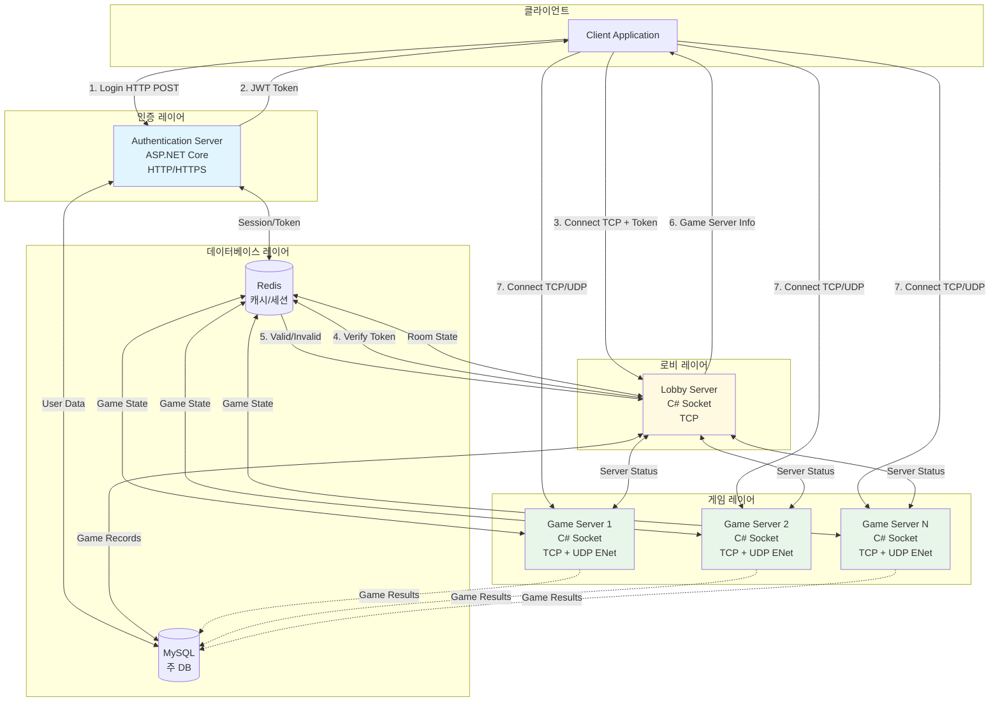

## 클라이언트 연결 플로우

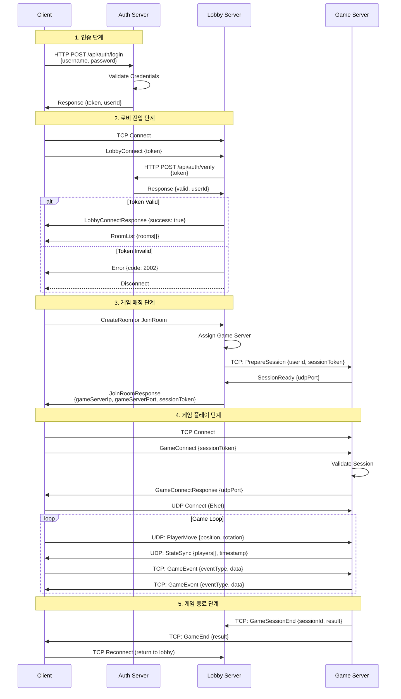

## 서버 간 통신 다이어그램

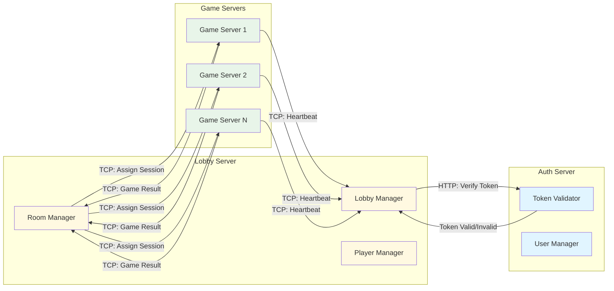

## 패킷 처리 플로우

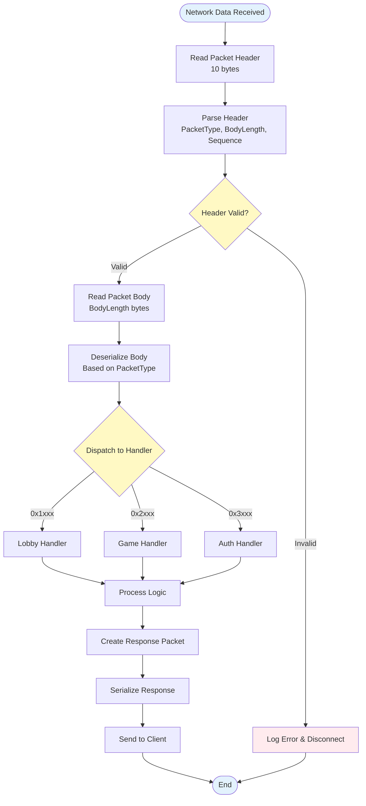

## 네트워크 프로토콜 레이어

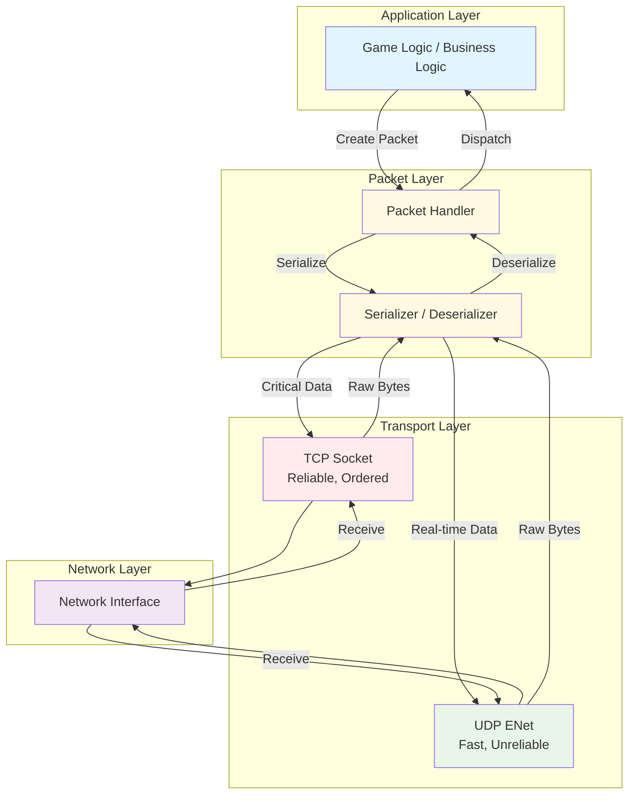

## 로비 서버 내부 구조

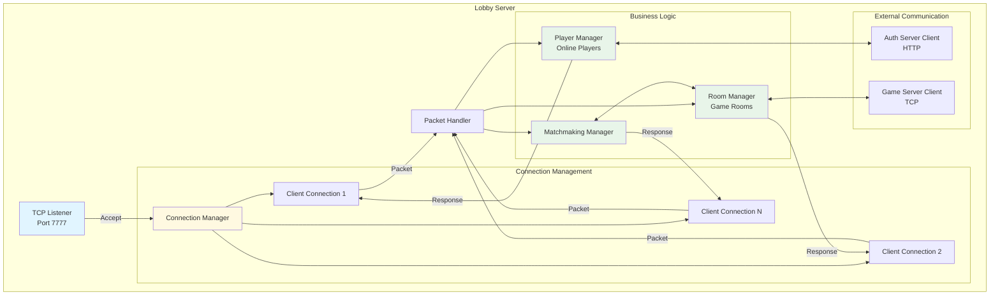

## 게임 서버 내부 구조

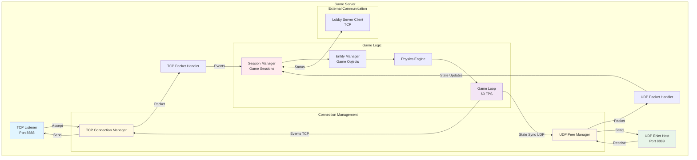

## 데이터베이스 아키텍처

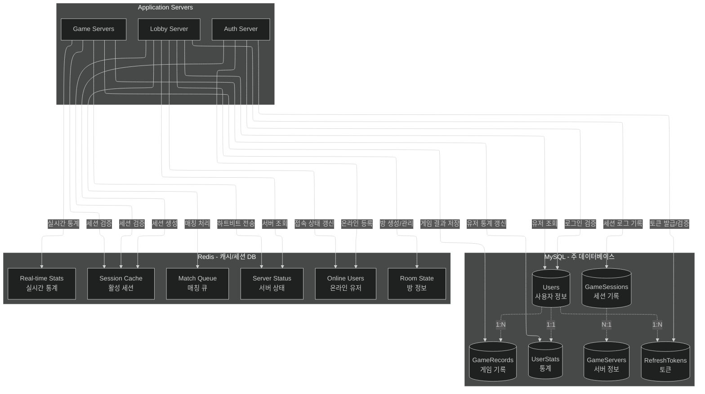

## 상태 전이 다이어그램 (클라이언트)

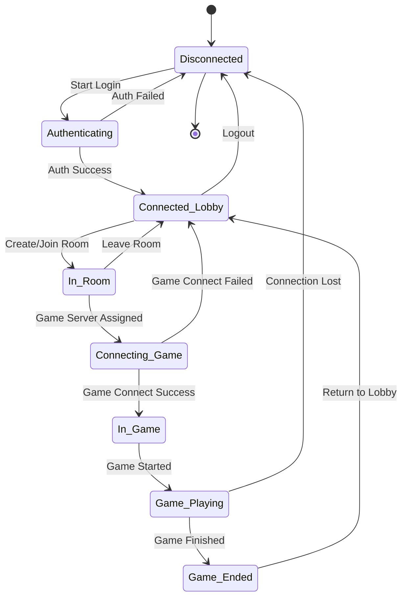

## 상태 전이 다이어그램 (게임 서버)

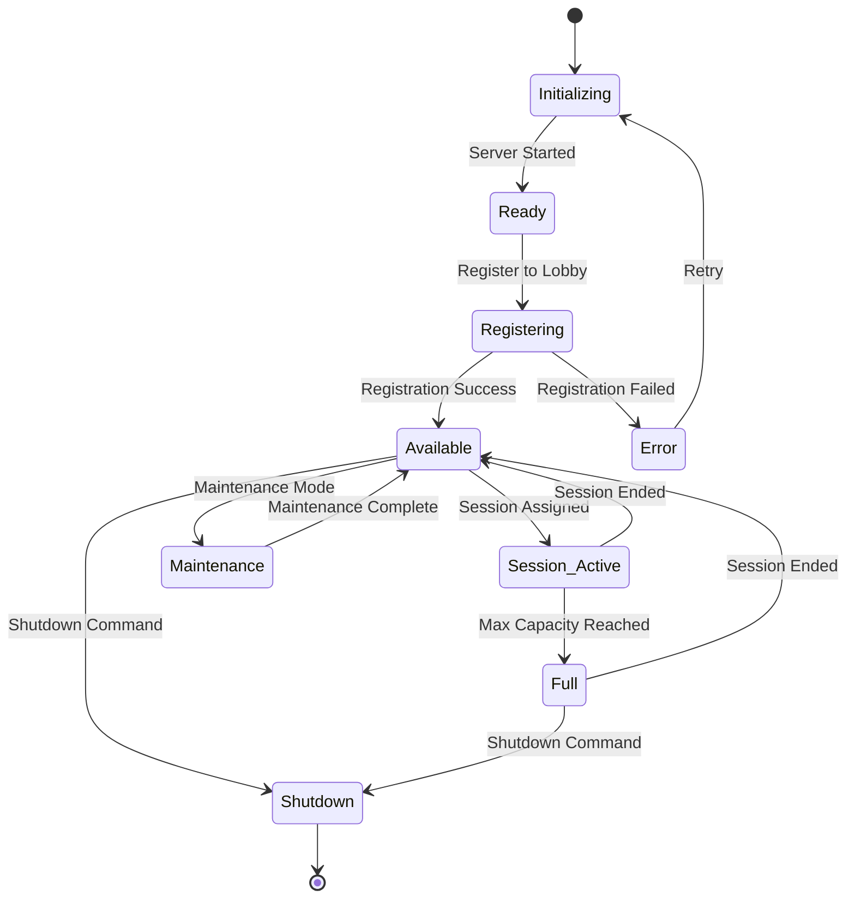

## 패킷 타입 계층 구조

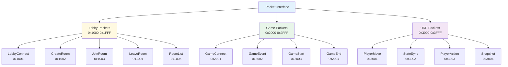

## 부하 분산 전략

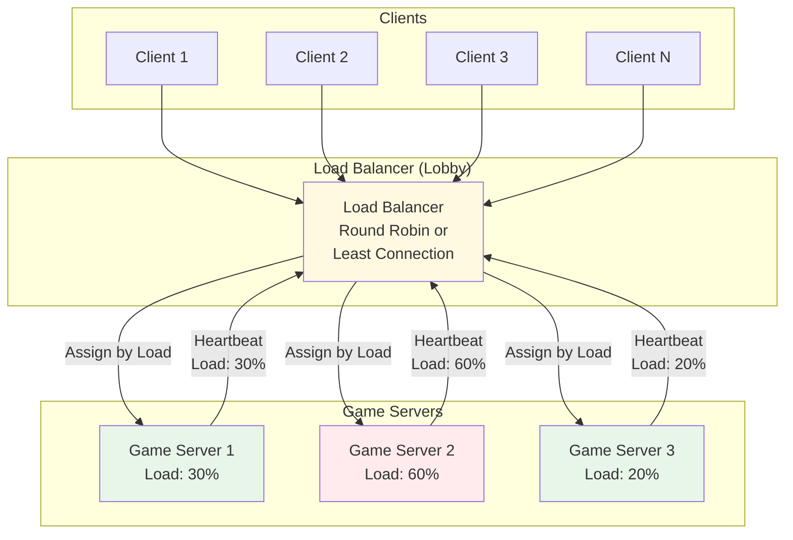

## 에러 처리 플로우

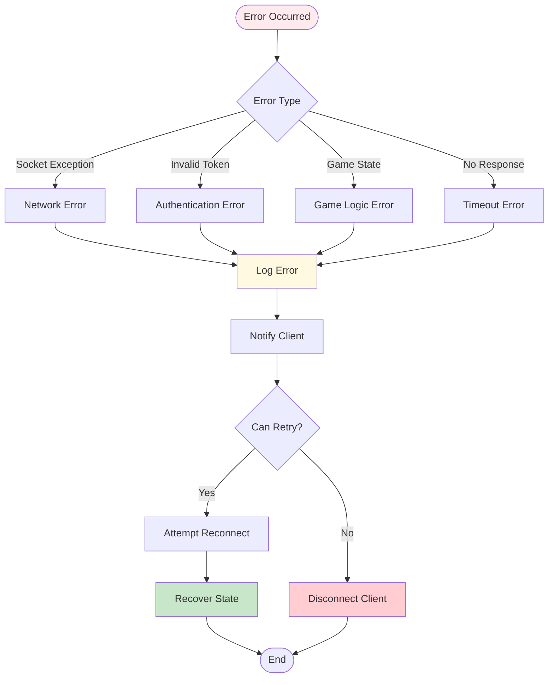

## 메모리 풀링 구조

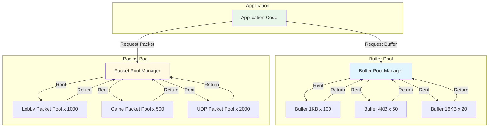
